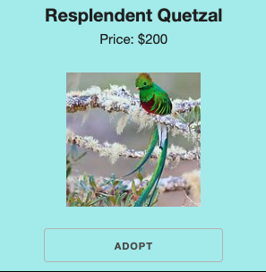
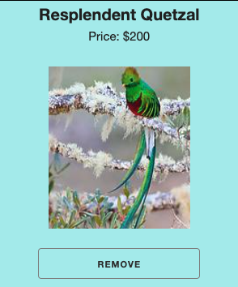

# Project Functionality

The following are instructions that we had to follow to complete the `Cart.js` component in our `Bird_Sanctuary_Project`

```md
### Cart

- The cart has a class name of `Cart`
- When I click on a bird card's adopt button, its name appears in the cart as an `<ol>` list item.
- The total shows up as an `<h4>` element inside the cart
- When I click on an additional item, the total cost is updated and additional bird name(s) is added as a list item to the unordered list
- When there are less than 3 birds in the cart there is a 0% discount
- When there are 3 or more birds in the cart there is a 10% discount

The bonuses come from `src/data/bonusItems.js`

- The bonus items are added as list items in an `<ul>` list item as follows:
- 1 bonus (first array item) is given if the total is between 100 and 300
- 2 bonuses (first and second array items) are given if the total is between 300 and 500
- 3 bonuses are given if the total is between 500 and 1000
- 4 bonuses are given if the total is more than 1000
```

Nowhere in the instructions were we told to create a `button` inside the `li` that is displayed in the `Cart` component. I believe this to be the case because of the cypress test shown below:

```js
// Lines 214 thru 225 in the ./cypress/.integration/birds.js
it("Deletes a bird on button click", () => {
  cy.get(".Cart li")
    .eq(1)
    .within(() => {
      cy.get("button").click();
    })
    .then(() => {
      cy.get(".Cart").within(() => {
        cy.contains("Boat Billed Heron").should("not.exist");
      });
    });
});
```

Furthermore the testing here is flawed. As per the instructions we were given here:

```md
The bonus items are added as list items in an `<ul>` list item as follows:

- 1 bonus (first array item) is given if the total is between 100 and 300
- 2 bonuses (first and second array items) are given if the total is between 300 and 500
- 3 bonuses are given if the total is between 500 and 1000
- 4 bonuses are given if the total is more than 1000
```

We are told to show these bonus items inside an `ul` which by definition contains `li` elements. That being said the test:

```js
// line 214 and 215 in the ./cypress/integration/birds.js
cy.get(".Cart li").eq(1);
```

Is looking for the `2nd` list element within `Cart` component. This can be further specified by writing it like this:

```js
cy.get(".Cart ol li").eq(1);
```

But again this logic is flawed as well due to these following lines:

```js
// lines 208 thru 213
before(() => {
  cy.visit(`http://localhost:${PORT}`);
  addFlycatcherToCart();
  addBoatBilledHeronToCart();
  addFlycatcherToCart();
});
```

The lines above click on the `Royal Flycatcher` then click on the `Boat Billed Heron` then click on the `Royal Flycatcher` again.

Now I will stop here because there is a reason why I bring this up. I will admit I glossed over the instructions and immediately starting setting up a plan on how to do this. Even tho the plan was very short and then I immediately began coding I ran into some issues with the logic this project proposes:

## This is our `BirdCard`



Normally in any website that we stumble upon the `click` of a `button` must do something. Therefore once I `click` on the `Adopt - Button` something needs to change like this:



Once the `Adopt` button is clicked it must be added to the cart and the text inside the `Adopt` button must be changed to `Remove` meaning that it has to be removed from cart. Each `Bird` has an `id` therefore there are no multiple instances of the birds hence it cannot be adopted twice. I managed to figure out the logic for this particular functionality after various trials and errors. Following my proposed logic, I achieved not only to change the `button` text from a single `BirdCard` that it was clicked on but I also managed to remove it from the `Cart` component as well. All of my tests are passing except the last two tests from cypress due to this conflict in logic. I want to bring this to your attention because it's hard for me to grasp the logic that is proposed we follow with the cypress testing. Therefore should I continue with my logic or the logic that cypress is presenting to us?

Thank you for hearing me out.
